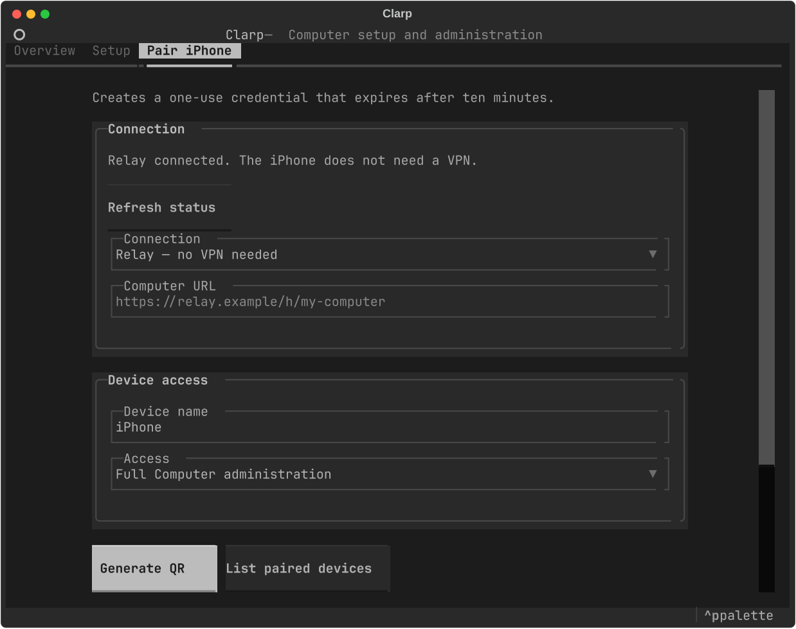

# Relay setup and authentication

Clarp owns its relay connector as part of the HTTP service. It starts and stops
with that service, reconnects after network interruptions, and does not require
a separately installed Python program or user service. Relay access can coexist
with Tailscale, LAN, or an existing HTTPS proxy.

## Pair a phone

Use `clarp-admin pair create --relay` to display a one-use QR code and Clarp
pairing link. The code expires after ten minutes by default. The phone exchanges
it for its own device credential; the Host stores only its hash. Normal app
connections remain automatic. List and revoke devices with `clarp-admin pair
list` and `clarp-admin pair revoke DEVICE_ID`. Revocation closes that device's
active HTTP/event-stream/WebSocket connections as well as rejecting new requests.

Passkeys, passwords, and recurring MFA prompts are not part of this setup.
Existing device credentials remain valid after the connector migration.

The Pair iPhone screen offers the primary connection and the managed relay when
both are available. It waits for the relay to connect before enabling Generate QR.



## Configure the connector

The relay operator supplies an HTTPS relay origin, Host ID and connector key.
Configure them once:

```
clarp-admin network relay configure --url https://relay.example --host-id HOST_ID
clarp-admin network relay enable --pair
```

The first command prompts for the connector key without echoing it. Automation
can use `--key-stdin`. Never put the key in command arguments. Clarp validates the
origin and keeps the credential in a mode-0600 `relay.json` beside `config.toml`.
The relay operator's master secret is never needed by the Host or the phone.
Provisioning accounts/Host keys at a hosted relay remains the operator's job;
these commands do not create an anonymous public relay registration service.

Inspect the connection with `clarp-admin network relay status`, or use
`clarp-admin network status` to see both network modes. Lost sessions are
recorded with their close code; see [relay connection diagnostics](../relay-connection-diagnostics.md). Disable the connector
with `clarp-admin network relay disable`. These operations preserve the primary
network configuration and Tailscale Serve routes. `network use off` disables the
managed relay too.

For the former standalone Linux connector, run:

```
clarp-admin network relay migrate --pair
```

This imports the private `relay.env` as data, retains the Host ID/key, stops the
old `clarp-relay-connector.service`, restarts Clarp and disables the old unit.
The old configuration is retained for recovery. A failed restart restores the
previous settings and restarts the old connector. Migration does not reconfigure
Tailscale or revoke paired phones.

## Authentication boundaries

- The administrator token is accepted only on direct loopback requests. Requests
  carrying proxy/relay metadata or coming from another browser origin do not
  gain administrator access merely because their socket reaches localhost.
- The managed connector always marks HTTP and WebSocket traffic as remote.
  Tailscale/HTTPS proxy metadata also prevents local-admin authentication.
  Other reverse proxies must preserve forwarding metadata; an unmarked proxy
  that deliberately impersonates a direct local client cannot be distinguished
  by an HTTP server sharing that listener.
- Remote clients authenticate with their paired-device bearer token or cookie.
  URL query credentials are accepted only for direct local bootstrap use.
  `clarp-admin pwa` consequently uses the local URL for administrator bootstrap.
- Remote networking refuses to start without configured authentication. A
  non-loopback listener without authentication is rejected, not merely warned.
- Failed authentication and failed pairing are limited per client source to
  twenty failures per minute, then return 429 with Retry-After. Valid credentials
  and valid pairing codes still work, so an attacker cannot lock out a paired
  phone just by exhausting that source's failure budget. This is failure
  throttling, not a general HTTP connection/resource rate limit.
- Access logs and request diagnostics redact token, access/refresh token,
  connector key and pairing-code query parameters. Transport errors expose only
  the exception class, never the credential-bearing connector URL.
- The connector bounds concurrent streams, buffered request bodies and response
  queues. Cancellation closes the local upstream socket; old connections cannot
  emit stale response frames through a new relay connection.

## Trust and compatibility

TLS terminates at the relay Worker. The relay operator can see forwarded request
content and device bearer credentials; this is not end-to-end encryption or
proof-of-possession authentication. Keep the Worker under a trusted operator.
Device credentials remain revocable bearer credentials; this change does not
introduce access/refresh-token rotation or claim to prevent replay of a stolen
valid device token.

Older remote clients configured with the shared administrator token must use
one-time device pairing. Check audio, events and terminal access through both
Tailscale and the relay when rolling out the stricter authentication policy.
